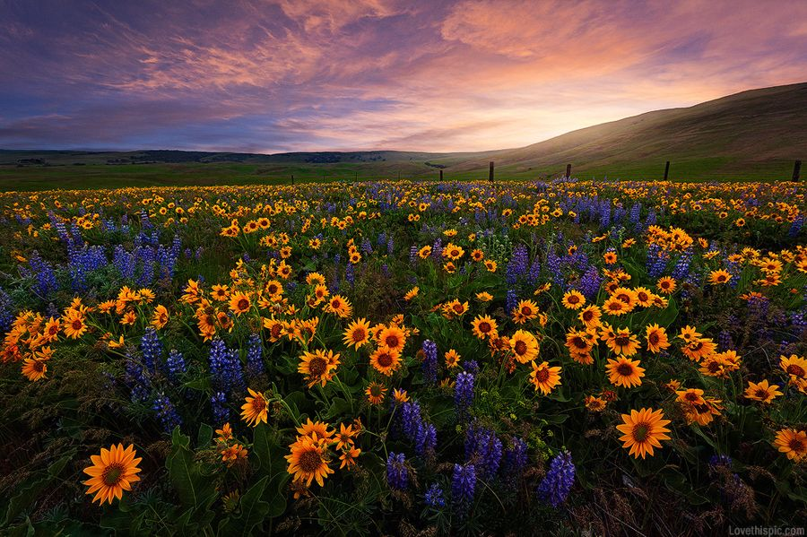
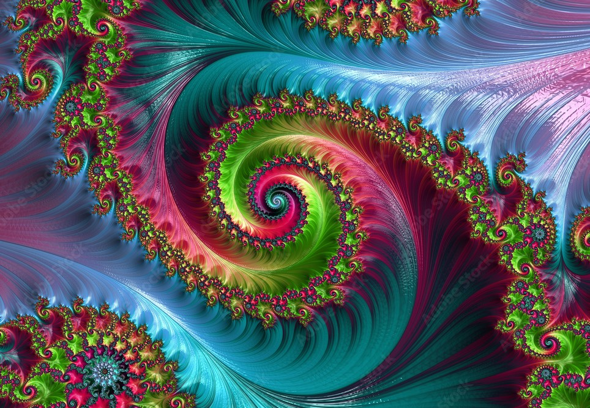

## Implementations
Implementation of foundational ML papers and algorithms

---
### Neural Style Transfer.
Style Image + Content Image = Generated Image

 

 &nbsp; &nbsp;&nbsp; &nbsp;
 
### Simple GAN's
